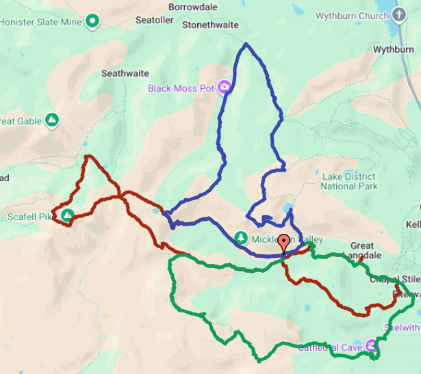

## Introduction

This is a summary of a 3-Day Walk I completed in July 2025 while staying at the Old Dungeon Ghyll Hotel. The long walk itself is quite demanding even for an experienced hiker and one should be prepared to journey over 6 hours each day. The GPX files for each day are provided below! 

## Day 1 - Scafell Pike, Bowfell & Fat Man's Agony

---
+ Distance: 33.9 km
+ Maximum Elevation: 957 m
+ Total climb: 1767 m
+ Total descent: 1771 m
---

When I looked at some of the recommended paths up to Scafell Pike from the hotel, I concluded that modifications needed to be made! Hence, I reworked it into a figure-of-eight and subsequently added the walk to Fat Man's Agony. If one is not feeling up to walking the entire thing, you will notice that after walking down the Band, one does return to the hotel, and it is possible to stop there. That being said that first part of the walk covers the largest peaks in the area bringing some spectacular views on a clear day. 

+ [Day 1 - GPX File](Day_1_Scafell_Pike.gpx)

## Day 2 - Cathedral Caves, Wrynose Pass & Crinkle Crags

---
+ Distance: 24.8 km
+ Maximum Elevation: 823 m
+ Total climb: 969 m
+ Total descent: 976 m
---

This route takes one to the East towards Ambleside, looping back beneath Mickleden Valley. Personally, I enjoyed the final section of the walk the most: the path throug Crinkle Crags is really beatiful and one can see the Scafell Pike mountain range all enveloped in clouds in the distance.

+ [Day 2 - GPX File](Day_2_Wrynose_Pass.gpx)

## Day 3 - Stickle Tarn, Loft Crag & Rossett Pike

---
+ Distance: 25.3 km
+ Maximum Elevation: 745 m
+ Total climb: 1243 m
+ Total descent: 1244 m
---

The final day is not as difficult the first two, and takes the walker to the North of the valley. From the peaks right by Stickle Tarn, Windermere and the surrounding scenery looks amazing, particularly the view from Loft Crag! The subsequent path through the marshy and muddy grassland towards Galleny Force Waterfall can be a little miserable on a wet day, so plan accordingly! 

+ [Day 3 - GPX File](Day_3_Stickle_Tarn.gpx)

