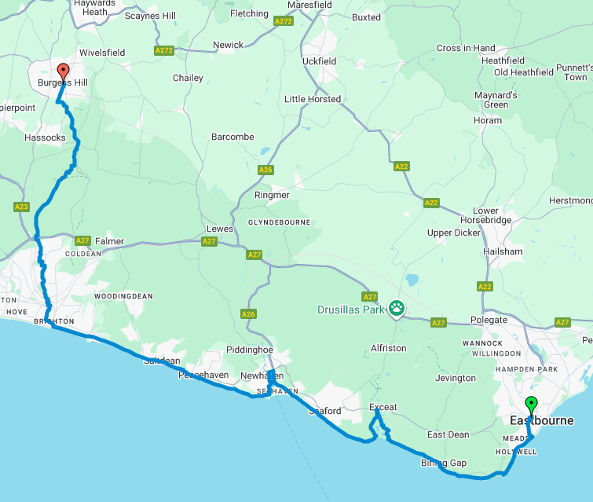

## Introduction

This is a long walk that I completed in 11:30 hours starting from the little town of Eastbourne and ending in Burgess Hill, a town about 15km to the north of Brighton. Although this was one of the most difficult long walks that I have ever been on, it was also the most rewarding. Not only did I have the opportunity to see the Seven Sisters, I watched the unset atop some of the tallest hills in the area!

## Eastbourne to Burgess Hill via Brighton

---
+ Distance: 61.3 km
+ Maximum Elevation: 229 m
+ Total climb: 573 m
+ Total descent: 531 m
---

The journey itself can be split into three parts: (i) Eastbourne to Seaford, (ii) Seaford to Brighton and (iii) Brighton to Burgess Hill. Each part is approximately 20km long, and each is beautiful it is own way. The first is all about the Seven Sisters which are in my view somewhat overrated due to the large number of people that are out and about even on weekdays. The second contains breathtaking views of the sea as one walk atop the cliffs leading to the Brighton Pier. The last is my personal favourite, and reflects the tranquility of the English countryside.

+ [GPX File](Eastbourne_Burgess_Hill.gpx.gpx)

