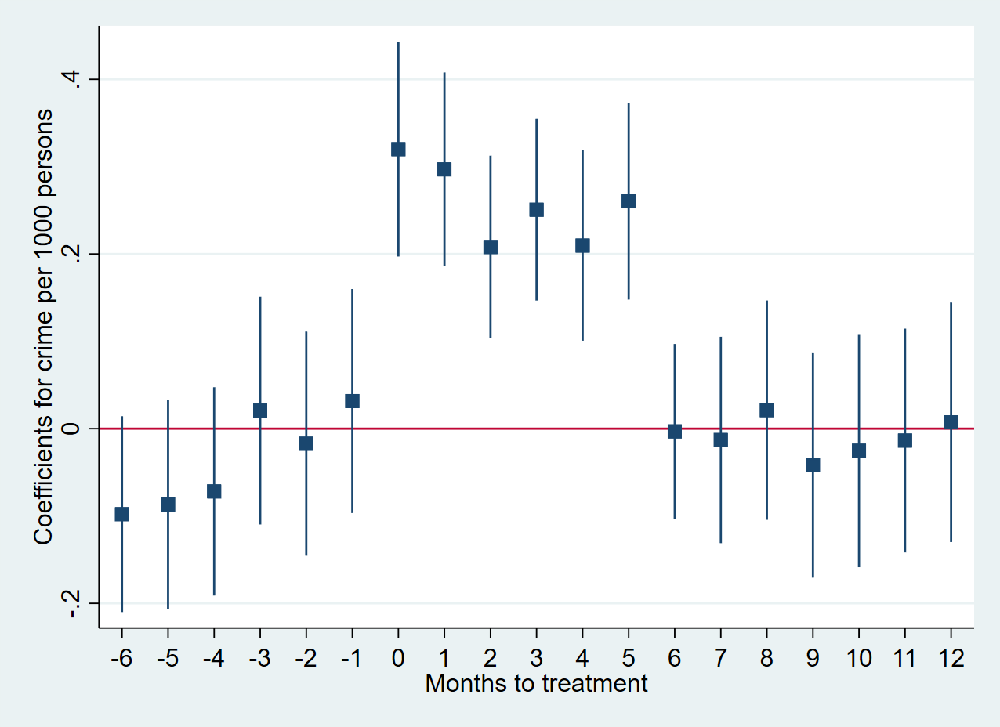

---

##### Download

+ [Paper](Minority-Salience-Crime-JMP-GA.pdf)

---

##### Abstract

This paper investigates how changes in the salience of Muslim communities impact local violent crime rates in England and Wales. Temporal shocks to Muslim salience are driven by terrorist attacks attributed to Muslim perpetrators. Leveraging police recorded crime data at the neighbourhood level, I use a matched difference-in-difference approach that exploits variation in the distribution of Muslim communities and the presence of mosques across England and Wales. The results show that, following a terrorist attack, violent crime increases by up to 13% in "Muslim" neighbourhoods, persisting for about six months. Moreover, I find evidence that the spike in violence is spatially diffuse and spills over to other minority groups. The impact is also larger in areas with greater religious fractionalization and support for right-wing parties. More broadly, the salience-crime link holds for other groups including Jewish communities, following the intensification of the Israeli-Palestinian conflict.

---

##### Figure 3: Event Study for Terrorist Attacks and Violent Crime

---