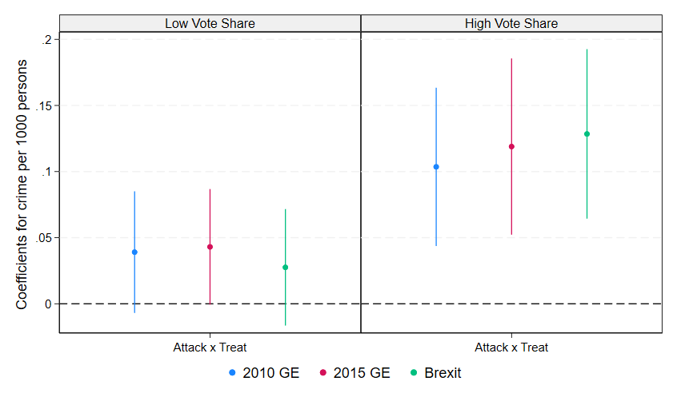

---

##### Download

+ [Paper](Minority-Salience-Crime-JMP-GA.pdf)

---

##### Abstract

This paper investigates how changes in the salience of Muslim communities affect local crime rates. Leveraging police recorded crime data, I use a Bartik-style estimation strategy exploiting the exogenous within-neighbourhood variation in salience generated by Islamic terrorist attacks. The results show a large increase in violent crime (≈ 3.2%), which is particularly pronounced for domestic attacks (≈ 5%). Heterogeneity analysis reveals that areas with lower education, religious diversity and migrant inflows experience more substantial violent backlash. Similarly, a wide gap is found between areas with high vs. low electoral support for right-wing and anti-immigrant parties. Findings are corroborated using a matched difference-in-difference approach and a battery of robustness checks.

---

##### Figure 6: Unadjusted Gap in Violent Backlash by Political Preferences

---