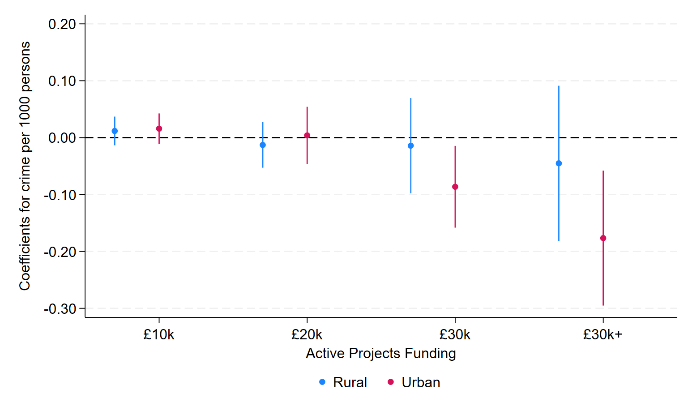

---

##### Download

+ [Paper Draft](Social_Projects_and_Crime_DRAFT.pdf)

---

##### Abstract

We estimate the impact of youth-targeted interventions on crimes in the neighbourhood using exogenous variation in the timing of projects funded by the UK National Lottery. Employing a difference-in-differences approach, we find that communities receiving concurrent interventions totalling £30,000 or more experience reductions in anti-social behaviour of up to 8.1 percent over a 24-month period, with effects intensifying to 10.1 percent in urban areas. These findings suggest that modest, targeted youth programs can generate meaningful reductions in community-level antisocial behaviour. Interestingly, our results indicate that larger infrastructure projects, such as sports centres, may actually increase crime rates by providing target points for youth crime. Overall, our results have important implications for the role of community projects in crime prevention strategies.

---

##### Figure 7: Intensive Margin of Small Projects in Urban/Rural Areas

---

