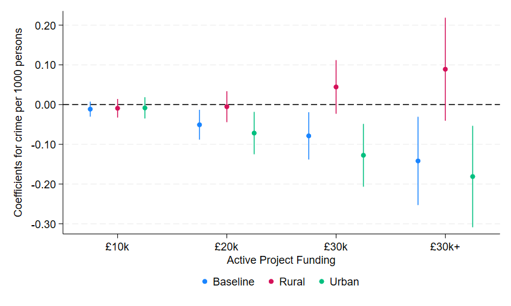

---

##### Download

+ [Working Paper](social_projects_wp.pdf)

---

##### Abstract

There is limited evidence on the effectiveness of community-based interventions at reducing local crime. Using quasi-random variation in thetiming and location of micro-projects funded by the UK National Lottery, and a difference-in-differences approach, we find that communities receiving concurrent interventions totalling £30,000 or more experienced reductions in anti-social behaviour of up to 5.7 percent over a 24-month period. However, property and violent crime increase in parallel, so that there is no effect on overall crime. Larger infrastructure projects, similarly financed, significantly reduce violent crime by nearly 4%; an effect that is not offset by changes to property crime. Although these interventions provide new targets for criminals, suitable chosen and targeted interventions can play an important role in crime prevention strategies.

---

##### Figure B4: Intensive Margin of Small Projects in Urban/Rural Areas

---

