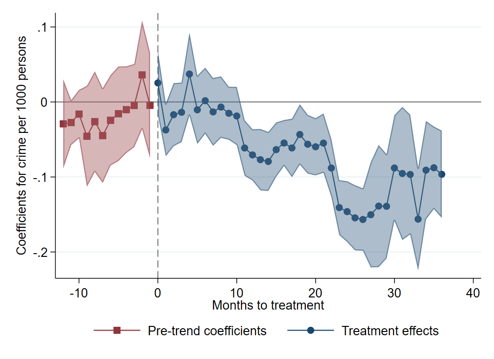

---

##### Download

+ [Working Paper](court_closures_wp.pdf)

---

##### Abstract

This paper provides the first causal evaluation of the mass closure of over half of all magistrate courts in England and Wales. Using a staggered difference-in-differences design applied to novel neighbourhood-level data on court closures, case transfers, and crime, I find that closures have a null average effect on reported crime but reduce police clearance rates by nearly 10%, consistent with offsetting "discouragement" and "deterrence" effects predicted by a simple theoretical model. By contrast, the transfer of caseloads to a remaining court causes property crime to fall and violent crime to rise by roughly 6% each, with comparable spillovers in neighbouring areas. Effects vary systematically with neighbourhood deprivation and with the affected court’s utilisation rate and operating cost. These in turn are driven by rising travel costs and to a broad decline in police investigative performance, suggesting that cost-driven judicial consolidation can meaningfully
undermine crime reporting and deterrence.
---

##### Figure 3: Event Study for Court Closures and Police Clearance Rates

---

